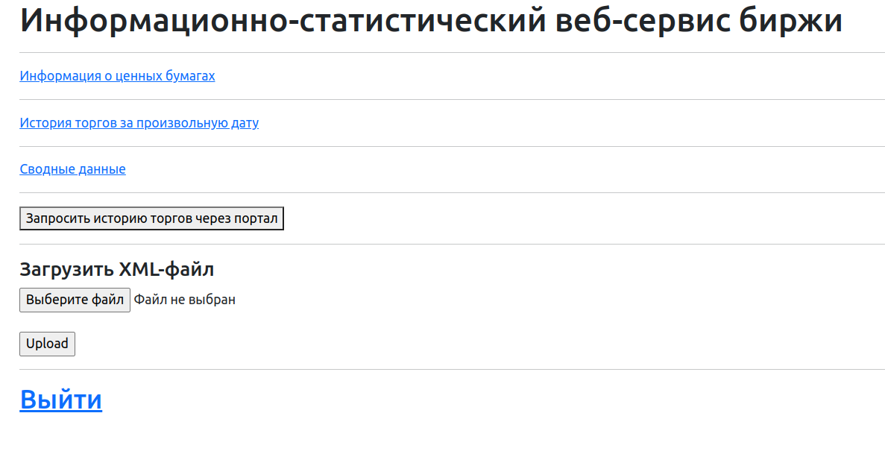

Это приложение предназначено для импорта и работы с данными по торговле ценными бумагами.
Приложение предоставляет функциональность импорта информации о ценных бумагах и истории торгов через XML-файлов или запрос, а также выполнение операций над данными.

**Архитектура**

Приложение разработано с использованием Java + Spring фреймворка и использует базу данных PostgreSQL для хранения данных. 
Spring Data JPA используется для операций с базой данных, а Thymeleaf - для серверной генерации HTML шаблонов и Bootstrap.
Также добавлены Spring Security для безопасности и Lombok для упрощения операций с данными. 
Для работы с XML-документами использовался NodeList и ArrayList для быстрого доступа к элементам и эффективной работы с ними. 

Реализовано хранение и работа с данными в БД;
Реализовано MVC приложение, позволяющее через интерфейс импортировать файлы и работать
со сводной таблицей (Удалять и выгружать данные)
Реализован импорт для загрузки файлов локально, а также запрос к API биржи

Импорт объектов из файлов
Приложение поддерживает импорт объектов "Информация о ценных бумагах" и "История торгов за произвольную дату" из прикрепленных XML файлов.

Импорт объектов из запроса биржи
Приложение поддерживает запрос истории по отсутствующей ценной бумаге.

**Объект "Информация о ценных бумагах" SecuritiesDataHub.**

Для объекта "Информация о ценных бумагах" должны присутствовать следующие поля:
- id
- secid
- regnumber
- name
- emitent_title

**Объект "История торгов за произвольную дату" TradeHistoryTracker.**

Для объекта "История торгов за произвольную дату" должны присутствовать следующие поля:
- id
- secid (поле ссылается на SecuritiesDataHub)
- tradedate
- numtrades
- open
- close

**Сводные данные.**

Приложение также предоставляет отдельную сводную страницу Summary для вывода сводных данных на основе сущностей 
"Информация о ценных бумагах" и "История торгов за произвольную дату". 
Выводятся следующие поля:
- secid
- regnumber
- name
- emitent_title
- tradedate
- numtrades
- open
- close

**Запуск приложения**

Для запуска приложения необходимо выполнить следующие шаги:
 
1. Установите JDK версии 17 или выше.
2. Установите Intellij IDEA.
3. Склонируйте репозиторий.
4. Установите PostgreSQL сервер и создайте базу данных для приложения (exchange - название БД).
5. В файле application.properties настройте доступ к базе данных, указав URL, имя пользователя и пароль. (Настройки сохранены по умолчанию. Название БД exchange)
6. Запуск приложения через Application.class
7. Приложение будет доступно по адресу http://localhost:8080.

**Пользовательская инструкция**

1. Чтобы пользоваться сервисом, нужно пройти простую регистрацию
2. Главное меню состоит их трех страниц:
- Информация о ценных бумагах (просмотр, редактирование)
- История торгов за произвольную дату (просмотр)
- Сводные данные (просмотр, удаление выборочное, или удаление полного списка)
и из функционала загрузки XML-файлов и запроса к бирже

На каждой странице присутствует счетчик количества записей.

Приложение доступно для расширения функционала и поддержки разных запросов.

**Инструкция для программистов**

Приложение состоит из базовой конфигурации запуска сервера и авторизации как пользователь (добавлен опционально). Cостоит из сущностей, шаблонов представлений, контроллеров с вспомогательными абстракциями для работы с операциям 

**_Сущности_:**

**SecuritiesDataHub** - сущность для "Информация о ценных бумагах"

**TradeHistoryTracker** - сущность для "История торгов за произвольную дату", ссылается на SecuritiesDataHub

**User** - отдельная сущность пользователей, ни на кого не ссылается

**_Контроллеры_**:

**SecuritiesDataHubController** - для работы со списком ценных бумаг. Поддерживает редактирование полей.

**TradeHistoryTrackerController** - для работы со списком истории бумаг.

**SummaryController** - использует для работы с сущностями SecuritiesDataHub и TradeHistoryTracker и отображения сводных данных, удаление построчно или полное удаление всего списка.

**XmlApiController** и **XmlDocController** - контроллеры для работы с импортом данных

**AuthorityController** - для работы с регистрацией 

**UniversalXmlParserService** - адаптер для парсинга полученных данных из GET-запросов, или файлов.

Добавлен **testRequestStatus**() для проверки запроса.

[schema.puml](schema.puml)

**Вложения:**

XML-файлы для тестирования работы загрузки файлов находятся здесь src/main/resources/xmlFilesForTests
[history.xml](src%2Fmain%2Fresources%2FxmlFilesForTests%2Fhistory.xml),
[securities.xml](src%2Fmain%2Fresources%2FxmlFilesForTests%2Fsecurities.xml).
